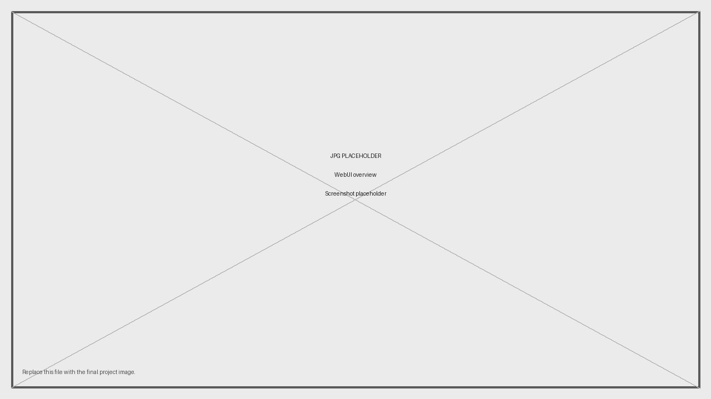

# OpenCurtainLab

**OpenCurtainLab is an open-source shutter tester for analog camera shutters.**

It combines an ESP32, five optical sensor channels, a flash-sync input, an OLED display, and a standalone browser WebUI. The firmware records raw shutter timing locally. The WebUI analyzes that data into exposure time, exposure deviation, shutter spread, curtain travel behavior, flash-sync timing, charts, project history, backups, CSV exports, and standalone camera reports.

OpenCurtainLab is intended for camera repair, calibration work, repeatable shutter testing, and local documentation of analog camera bodies. It does not require a cloud service or proprietary backend.

<p align="center">
  
  
</p>

## Current hardware baseline

The firmware configuration in `src/Config.h` is the source of truth for this release.

| Area | Current value |
|---|---|
| Firmware version | `0.1.1` |
| Device name | `OpenCurtainLab` |
| mDNS name | `opencurtainlab.local` |
| Sensor channels | 5 |
| Sensor spacing X | `7.62 mm` (`3 × 2.54 mm`) |
| Sensor spacing Y | `5.08 mm` (`2 × 2.54 mm`) |
| Default mode | `horizontal` |
| Flash-sync input | GPIO14, active low |
| Buttons | Up GPIO27, Down GPIO26, Select GPIO25 |
| OLED | SSD1306 128×64 over I2C, address `0x3C`, SDA GPIO21, SCL GPIO22 |

## Features

### Measurement hardware

- Five optical sensor channels for focal-plane shutter timing.
- Measurement modes for horizontal-travel, vertical-travel, and central/leaf shutters.
- Flash-sync input for X-sync timing checks.
- OLED display for setup state, network state, target speed, measurement state, and quick result review.
- Three active-low local buttons for operation without a computer.
- Optional battery-voltage monitoring through a resistor divider.

### Standalone WebUI

- Runs as a normal local HTML file after being downloaded from the device.
- Connects to the ESP32 over the local network.
- Shows measured exposure time, deviation from target speed, shutter spread, and measurement hints.
- Provides timeline, curtain-speed, exposure, and flash-sync visualizations.
- Stores projects and measurement history in browser storage.
- Supports workspace backup import/export, calculated CSV export, and standalone HTML camera reports.

### Local HTTP API

- Local endpoints for status, configuration, diagnostics, WiFi setup, and raw measurement data.
- JSON responses for scripts, tools, or alternative UIs.
- Live sensor diagnostics for wiring, optical alignment, and threshold troubleshooting.

## Repository layout

```text
OpenCurtainLab.ino          Main Arduino sketch and application loop
src/                        Firmware modules, configuration, measurement logic, API, WiFi, OLED
web/                        WebUI source files
web/compiled/               Generated standalone WebUI release file
tools/                      Release and development helper scripts
docs/BUILD_GUIDE.md         Hardware, firmware, and upload guide
docs/API.md                 Firmware HTTP API reference
LICENSE                     Project license
```

## Build the device

The complete hardware and firmware build process is documented here:

**[Open the build guide](docs/BUILD_GUIDE.md)**

The guide covers:

- parts and tools
- ESP32 pinout
- sensor, button, OLED, flash-sync, and battery wiring
- sensor geometry from the current firmware configuration
- Arduino IDE and Arduino CLI setup
- required library versions
- first electrical checks and troubleshooting

<p align="center">
  
</p>

## Basic use

### 1. Flash and power the device

Upload the firmware, connect the electronics, and power the ESP32. The OLED shows the current device state.

### 2. Configure WiFi

On first start, the device opens a setup access point named `OpenCurtainLab`. Connect to that access point, open the captive portal, select your WiFi network, enter the password, and save the settings.

### 3. Download the WebUI

After the device is connected to your network, open:

```text
http://opencurtainlab.local
```

The device downloads the compatible compiled WebUI release through the manifest proxy and serves it as `opencurtainlab.html`. Save or open that file in a browser and connect it to the device address shown on the OLED.

### 4. Make a measurement

Place the five-sensor assembly at the camera film gate, point a stable light source through the shutter, select the measurement mode and target speed, and fire the shutter. The firmware records raw timestamps and the WebUI performs the exposure and curtain analysis.

## Local button controls

The three buttons are active-low and wired to GND.

| State | Button | Action |
|---|---|---|
| Ready | Up | Select the next faster target speed. |
| Ready | Down | Select the next slower target speed. |
| Ready | Hold Up | Cycle measurement mode: horizontal, vertical, central. |
| Ready | Select | Open the OLED settings menu. |
| Menu | Up / Down | Move through menu entries. |
| Menu | Select | Change the selected value. |
| Menu | Hold Select | Save menu settings and return to ready mode. |
| Results | Up / Down | Switch result pages or leave the result view. |
| Results | Select | Close result view and return to ready mode. |

The OLED menu gives quick access to sensor sensitivity, target time series, result display behavior, OLED sleep timeout, and network reset.

<p align="center">
  
</p>

## API documentation

The firmware exposes a local HTTP API for status, runtime configuration, WiFi setup, live sensor diagnostics, and measurement data.

**[Open the API documentation](docs/API.md)**

Typical endpoints:

```text
GET  /version
GET  /status
GET  /config
POST /config
GET  /data
GET  /sensors
GET  /wifi/status
GET  /wifi/scan
POST /wifi
```

## AI usage transparency

AI tools were used during development as an assistant for code review, refactoring, documentation drafting, and implementation exploration. The project design, hardware decisions, test results, firmware behavior, API behavior, and published releases remain the responsibility of the maintainer.

## License

OpenCurtainLab is released under the MIT License. See [LICENSE](LICENSE).
