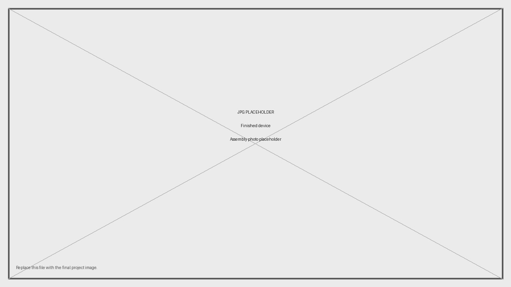
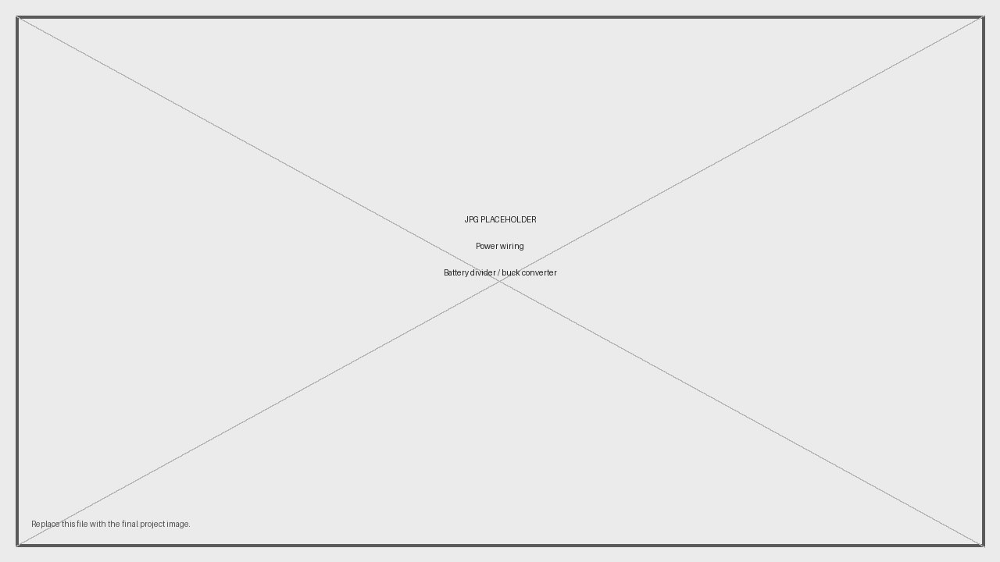

# OpenCurtainLab Build Guide

This guide describes the current OpenCurtainLab hardware and firmware baseline. The firmware configuration in `src/Config.h` is the source of truth for pins, timing constants, sensor geometry, and factory defaults.



## 1. Safety and required experience

OpenCurtainLab is a low-voltage ESP32 project, but it still requires careful wiring and testing. Build it only if you are comfortable with soldering, measuring voltage with a multimeter, uploading ESP32 firmware, and checking circuits before applying power.

Do not connect unknown battery voltages directly to an ESP32 development board. Use a suitable regulator or power input for your specific ESP32 board, and verify the voltage before installing the ESP32.

## 2. Parts

The example sources are not required sources. Use parts with equivalent electrical ratings and dimensions.

| Qty | Part | Purpose | Notes |
|---:|---|---|---|
| 1 | ESP-WROOM-32 / ESP32 development board | Main controller | Must expose GPIO36, GPIO39, GPIO34, GPIO35, GPIO32, GPIO33, GPIO14, GPIO21, GPIO22, GPIO25, GPIO26, and GPIO27. |
| 5 | NPN phototransistor, for example PT2046C | Optical shutter sensors | One phototransistor per sensor channel. |
| 5 | 10 kΩ resistor | Sensor pull-up resistors | One resistor per sensor channel. |
| 1 | SSD1306 OLED display, 128×64 | Local display | I2C display, address `0x3C`. |
| 3 | Momentary push button | Local controls | Active-low buttons wired to GND. |
| 1 | 3.5 mm jack socket or matching sync connector | Flash-sync input | Active-low contact input. |
| 1 | Flash-sync cable or hot-shoe adapter | Camera connection | Match the camera body under test. |
| 1 | 3.3 V regulator or suitable ESP32 power path | Power supply | Required when the selected battery/input voltage is not safe for the ESP32 board. |
| 1 | Perfboard, custom PCB, or two-board assembly | Electronics carrier | Main/control board plus sensor board is recommended. |
| 1 | 330 kΩ resistor | Battery divider high side | Optional battery monitor. |
| 1 | 100 kΩ resistor | Battery divider low side | Optional battery monitor. |
| as needed | Headers, wires, connectors, screws, spacers, inserts, strain relief | Assembly | Select parts that fit the enclosure and sensor holder. |
| as needed | Sensor holder and enclosure | Mechanical assembly | Must position the sensor board repeatably at the camera film gate. |

## 3. Tools

- Soldering iron and solder
- Wire stripper and side cutter
- Multimeter
- Computer with Arduino IDE 2.x or Arduino CLI
- USB cable for the ESP32 board
- Stable light source for testing
- Camera body or test shutter
- 3D printer or manufactured mechanical parts, if using a printed enclosure or sensor holder

## 4. Firmware baseline

| Setting | Current value |
|---|---|
| Firmware version | `0.1.1` |
| Device name | `OpenCurtainLab` |
| mDNS host | `opencurtainlab.local` |
| Sensor count | `5` |
| Sensor spacing X | `7.62 mm` (`3 × 2.54 mm`) |
| Sensor spacing Y | `5.08 mm` (`2 × 2.54 mm`) |
| Default measurement mode | `horizontal` |
| Default target time | `500` (`1/500 s`) |
| Default sensor sensitivity | `medium` |
| OLED address | `0x3C` |
| OLED size | `128 × 64` |

## 5. ESP32 pinout

The default pinout is defined in `src/Config.h`.

| Function | Firmware symbol | GPIO |
|---|---|---:|
| Sensor 0 | `PIN_SENSOR_0` | 36 |
| Sensor 1 | `PIN_SENSOR_1` | 39 |
| Sensor 2 | `PIN_SENSOR_2` | 34 |
| Sensor 3 | `PIN_SENSOR_3` | 35 |
| Sensor 4 | `PIN_SENSOR_4` | 32 |
| Battery ADC | `PIN_BATTERY_ADC` | 33 |
| Flash sync | `PIN_FLASH_SENSOR` | 14 |
| Up button | `PIN_BTN_UP` | 27 |
| Down button | `PIN_BTN_DOWN` | 26 |
| Select button | `PIN_BTN_SELECT` | 25 |
| OLED SDA | `I2C_SDA` | 21 |
| OLED SCL | `I2C_SCL` | 22 |

GPIO36, GPIO39, GPIO34, and GPIO35 are input-only pins on common ESP32 modules. That is suitable for the sensor channels.

## 6. Sensor board

The current geometry is based on perfboard spacing:

```cpp
static constexpr float SENSOR_DISTANCE_X_MM = 3*2.54f; // 7.62 mm
static constexpr float SENSOR_DISTANCE_Y_MM = 2*2.54f; // 5.08 mm
```

Use that geometry when placing neighboring sensors. If you change the physical layout, update `SENSOR_DISTANCE_X_MM` and `SENSOR_DISTANCE_Y_MM` in `src/Config.h` before building firmware and release files.

Recommended circuit per sensor:

```text
3.3 V ---- 10 kΩ ----+---- ESP32 ADC pin
                     |
              phototransistor
                     |
GND -----------------+
```

In this arrangement, the ADC value is high in darkness and lower when light reaches the phototransistor.

Current threshold presets:

| Sensitivity | Active when raw is at or below | Released when raw is at or above |
|---|---:|---:|
| Low | 1100 | 1250 |
| Medium | 2100 | 2250 |
| High | 3100 | 3250 |

Use `/sensors` or the WebUI developer helper `oclSensors()` to check raw values before making camera measurements.


## 7. Flash-sync input

The flash-sync input is active-low and uses the ESP32 internal pull-up.

```text
3.5 mm jack tip    ---- GPIO14 / PIN_FLASH_SENSOR
3.5 mm jack sleeve ---- GND
```

When the camera closes the flash-sync contact, GPIO14 is pulled to GND and the firmware records `flash.triggerUs`.

## 8. OLED display

Connect the SSD1306 OLED over I2C:

```text
OLED VCC  -> 3.3 V
OLED GND  -> GND
OLED SDA  -> GPIO21 / I2C_SDA
OLED SCL  -> GPIO22 / I2C_SCL
```

Default display configuration:

```cpp
#define OLED_ADDRESS     0x3C
#define SCREEN_WIDTH     128
#define SCREEN_HEIGHT    64
#define DISPLAY_ROTATION 0
```

## 9. Buttons

All buttons are active-low. Wire each button between the configured GPIO and GND.

```text
GPIO27 -- Up button ----- GND
GPIO26 -- Down button --- GND
GPIO25 -- Select button - GND
```

The firmware enables internal pull-ups and applies debounce timing.

```cpp
#define DEBOUNCE_MS  50UL
#define MODE_HOLD_MS 1000UL
```

## 10. Battery monitor

Battery monitoring is enabled by default:

```cpp
static constexpr bool BATTERY_MONITOR_ENABLED = true;
```

The current divider uses nominal 330 kΩ / 100 kΩ values:

```text
Battery + ---- 330 kΩ ----+---- GPIO33 / PIN_BATTERY_ADC
                          |
                        100 kΩ
                          |
GND ----------------------+
```

Recommended filter capacitor:

```text
GPIO33 ---- 100 nF ---- GND
```

The current firmware values are:

```cpp
#define BATTERY_DIVIDER_HIGH_OHMS  330000.0f
#define BATTERY_DIVIDER_LOW_OHMS   100000.0f
#define BATTERY_EMPTY_VOLTAGE      7.0f
#define BATTERY_FULL_VOLTAGE       9.3f
```

For better accuracy, measure the installed resistors and enter the measured values in `src/Config.h`.



## 11. Board and enclosure layout

OpenCurtainLab can be built on perfboard or custom PCBs. A practical layout uses two assemblies:

1. Main/control board with ESP32, OLED connector, buttons, flash-sync jack, power input, and battery divider.
2. Sensor board with five phototransistors, five pull-up resistors, fixed sensor spacing, and a connector to the main board.

Recommended layout checks:

- Keep sensor traces short and similarly routed.
- Add a common ground reference near the sensor connector.
- Label every connector with signal name and orientation.
- Keep switching regulators away from ADC sensor traces and the battery divider node.
- Add test pads for 3.3 V, GND, every sensor ADC channel, battery ADC, and flash sync.
- Ensure the sensor holder cannot touch shutter curtains, film rails, or pressure-plate surfaces.
- Use matte dark material or internal shielding to reduce reflections and ambient-light leakage.


## 12. Assembly

### Step 1: Prepare the electronics carrier

1. Cut the perfboard or prepare the PCBs.
2. Mark connector orientation and signal names.
3. Inspect copper tracks, pads, and solder bridges.
4. Keep the ESP32 uninstalled until the power rails have been checked.

### Step 2: Assemble the sensor channels

1. Install the five phototransistors.
2. Install one 10 kΩ pull-up resistor per sensor channel.
3. Connect each sensor node to its configured ESP32 ADC pin.
4. Connect all sensor grounds to common GND.
5. Check resistance between 3.3 V and GND before applying power.

### Step 3: Assemble display, buttons, flash sync, and battery divider

1. Wire OLED VCC, GND, SDA, and SCL.
2. Wire Up, Down, and Select buttons to GPIO27, GPIO26, GPIO25, and GND.
3. Wire the flash-sync jack to GPIO14 and GND.
4. Install the battery divider if battery monitoring is used.

### Step 4: Verify power

1. Power the regulator or board input without the ESP32 installed, if possible.
2. Confirm the 3.3 V rail with a multimeter.
3. Confirm common ground between the main board and sensor board.
4. Check that no signal pin is shorted to 3.3 V or GND.

### Step 5: Install and power the ESP32

1. Install or plug in the ESP32 board.
2. Power from USB first.
3. Confirm that the OLED initializes.
4. Confirm that the setup AP appears on first boot if no WiFi credentials are saved.

### Step 6: Mechanical installation

1. Install the sensor board in the sensor holder.
2. Install the main electronics in the enclosure.
3. Route sensor and sync cables with strain relief.
4. Keep all sharp solder joints and wire ends away from camera surfaces.
5. Close the enclosure only after diagnostics pass.

## 13. Firmware setup

### 13.1 Recommended toolchain and library versions

These versions are pinned for reproducible builds of the current source tree.

| Component | Version | Why it is needed |
|---|---:|---|
| ESP32 Arduino core by Espressif Systems | `3.3.10` | Provides ESP32 board support, WiFi, WebServer, Preferences, mDNS, ADC, GPIO, timing, HTTPClient, and WiFiClientSecure. |
| ArduinoJson | `7.4.3` | JSON serialization and parsing for firmware API responses, settings updates, WiFi setup, and WebUI manifest handling. |
| Adafruit GFX Library | `1.12.6` | Graphics base library used by the OLED driver. |
| Adafruit SSD1306 | `2.5.17` | SSD1306 OLED driver. |
| Adafruit BusIO | `1.17.4` | Adafruit display stack dependency for I2C/SPI bus helpers. |

`Wire`, `WiFi`, `WebServer`, `Preferences`, `DNSServer`, `ESPmDNS`, `HTTPClient`, and `WiFiClientSecure` are provided by the ESP32 Arduino core and do not need separate Library Manager installs.

Last checked for this guide: 2026-06-29.

### 13.2 Arduino IDE setup

1. Install Arduino IDE 2.x.
2. Add the Espressif ESP32 Boards Manager URL in Arduino IDE preferences:

```text
https://espressif.github.io/arduino-esp32/package_esp32_index.json
```

3. Open **Tools → Board → Boards Manager**.
4. Search for `esp32`.
5. Install **esp32 by Espressif Systems**, version `3.3.10`.
6. Open **Tools → Manage Libraries**.
7. Install the exact library versions listed above.
8. Open `OpenCurtainLab.ino`.
9. Select your ESP32 board and port.
10. Compile and upload.

### 13.3 Arduino CLI setup

Example commands:

```bash
arduino-cli config init
arduino-cli config set board_manager.additional_urls https://espressif.github.io/arduino-esp32/package_esp32_index.json
arduino-cli core update-index
arduino-cli core install esp32:esp32@3.3.10

arduino-cli lib install "ArduinoJson@7.4.3"
arduino-cli lib install "Adafruit GFX Library@1.12.6"
arduino-cli lib install "Adafruit SSD1306@2.5.17"
arduino-cli lib install "Adafruit BusIO@1.17.4"
```

Compile and upload, replacing the FQBN and serial port with the values for your board:

```bash
arduino-cli compile --fqbn esp32:esp32:esp32 .
arduino-cli upload  --fqbn esp32:esp32:esp32 -p /dev/ttyUSB0 .
```

On macOS the port often looks like `/dev/cu.usbserial-*`. On Windows it usually looks like `COM3`, `COM4`, or similar.

## 14. Runtime configuration

Open `src/Config.h` when adapting the build to different hardware.

Common values to adjust:

| Setting | Meaning |
|---|---|
| `BATTERY_MONITOR_ENABLED` | Set to `false` when the battery divider is not installed. |
| `BATTERY_DIVIDER_HIGH_OHMS` / `BATTERY_DIVIDER_LOW_OHMS` | Installed battery-divider resistor values. |
| `BATTERY_EMPTY_VOLTAGE` / `BATTERY_FULL_VOLTAGE` | Voltage range used for battery percentage. |
| `SENSOR_DISTANCE_X_MM` / `SENSOR_DISTANCE_Y_MM` | Physical spacing between neighboring sensors. |
| `SENSOR_ON_THRESHOLD_*` / `SENSOR_OFF_THRESHOLD_*` | Raw ADC hysteresis thresholds for light detection. |
| `DEFAULT_MEASUREMENT_MODE` | Startup measurement mode. |
| `DEFAULT_TARGET_TIME` | Startup target denominator. |
| `DEFAULT_SENSOR_SENSITIVITY` | Startup threshold preset. |

After changing firmware constants or WebUI files, run the release helper before publishing generated files:

```bash
python3 tools/release.py
```

For local development without checking the remote manifest:

```bash
python3 tools/release.py --skip-manifest-check
```

## 15. First checks

1. Open the serial monitor after upload.
2. Confirm that the OLED shows a valid startup state.
3. Connect to the `OpenCurtainLab` setup AP on first boot.
4. Configure WiFi.
5. Open `http://opencurtainlab.local` or the IP shown on the OLED.
6. Download the WebUI.
7. Open `/sensors` and check all raw sensor values in darkness and under light.
8. Trigger the flash-sync input manually and confirm that the flash diagnostic changes.
9. Make a test measurement without a camera before inserting the sensor holder into a camera body.

## 16. Troubleshooting

| Symptom | Likely cause | Check |
|---|---|---|
| Setup portal does not appear | Device is not in AP mode or power is unstable | OLED state, serial log, `OpenCurtainLab` WiFi network. |
| `opencurtainlab.local` does not resolve | mDNS unavailable on client | Use the IP address shown on the OLED. |
| OLED stays blank | Wrong I2C address, wiring issue, display fault | SDA/SCL, VCC, GND, `OLED_ADDRESS`. |
| Sensor is always active | Light leak, inverted wiring, threshold too high | `/sensors` raw value, phototransistor orientation. |
| Sensor never activates | Missing pull-up, phototransistor orientation, weak light, threshold too low | ADC voltage and `/sensors` raw value. |
| One sensor behaves differently | Solder joint, wrong resistor, damaged sensor, mechanical shadow | Compare raw values across all five channels. |
| Flash is always active | Jack shorted to GND | GPIO14 against GND. |
| Flash never triggers | Wrong cable/contact, no common ground, wrong jack wiring | Flash raw value in `/sensors`. |
| Battery shows `0 V` | Battery monitor disabled or divider missing | `BATTERY_MONITOR_ENABLED` and GPIO33 wiring. |
| Battery value is inaccurate | Nominal divider values differ from installed values | Measure resistors and update `Config.h`. |
| WebUI download fails | Manifest URL unavailable or WiFi problem | `/status`, `/version`, network access, manifest URL. |
